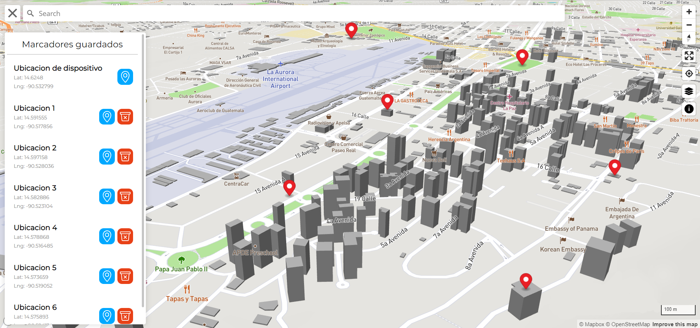

# Mapbox App

Aplicación web de mapas sencilla que cuenta con funcionalidades como: moverse por un mapa, buscar ubicaciones, o agregar marcadores y guardarlos en el almacenamiento del navegador. Utiliza como componente principal la librería Mapbox GL JS desarrollada por Mapbox, una muy interesante y potente alternativa para el uso de mapas interactivos en aplicaciones web.

## Tecnologías usadas
### Librerías

- [Mapbox GL JS](https://docs.mapbox.com/mapbox-gl-js/guides/)
- [mapbox-gl-geocoder](https://github.com/mapbox/mapbox-gl-geocoder)
- [mapbox-gl-style-switcher](https://github.com/el/style-switcher)

### Automatizadores

- [Vite](https://vitejs.dev/)

### Servicios

- [Mapbox](https://www.mapbox.com/)

### Fuentes
- [Montserrat](https://fonts.google.com/specimen/Montserrat)

## Getting started

1. `git clone https://github.com/HDMC3/mapbox-app.git`
2. `cd mapbox-app`
3. `npm install`
4. `npm run dev`

